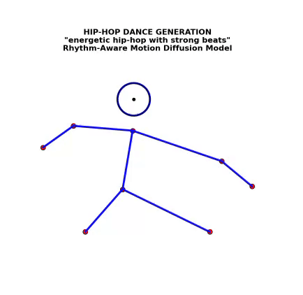
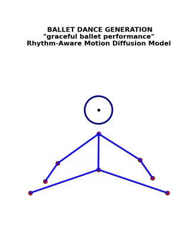
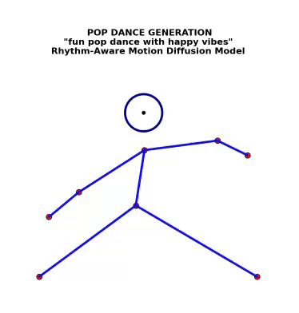
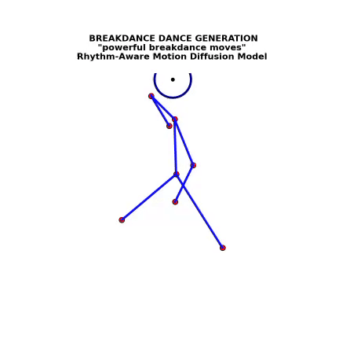

# Rhythm-Aware Human Motion Diffusion Model (RA-MDM)

> **Repository (current)**: `RA-MDM-Dance-Generation`

---

## 🎵 Project Overview

**Rhythm-Aware Human Motion Diffusion Model (RA-MDM)** generates synchronized, style-based dance animations driven by rhythm patterns and procedural motion logic. This repository contains:

* Complete **Python implementation** (in Google Colab)
* **Generated dance GIFs** for each style directly in the repo root (not in a subfolder)
* Supporting academic artifacts — **research paper**, **project synopsis**, and **presentation**

---

## 🚀 Highlights / Features

*  Supports 4 dance styles: **Hip-Hop**, **Ballet**, **Pop**, and **Breakdance (v3.1)**
*  Rhythm-aware motion modulation
*  Animated pose visualizations saved as GIFs
*  Diffusion-inspired procedural generation logic
*  Includes research paper, synopsis, and PPT for reference

---

## 📂 Repository Structure (current)

```
RA-MDM-Dance-Generation/
├─ README.md                  # (this file)
├─ mdm.ipynb                  # Google Colab notebook containing the full code
├─ hiphop.gif                 # Output: Hip-Hop animation
├─ ballet.gif                 # Output: Ballet animation
├─ pop.gif                    # Output: Pop animation
├─ breakdance.gif             # Output: Breakdance animation (v3.1 logic)
├─ mdm_final_research_paper.pdf # Research Paper(Under Review)

> 🧠 Note: This research paper is currently under review and has not yet been formally published.  
> Please do not cite or distribute without permission.
```

> **Note:** GIFs are stored directly in the repository root, not in a separate folder.

---

## 🧭 How to Run (Google Colab)

You can run this project directly on **Google Colab**:

1. Open `Untitled6.ipynb` in Colab.
2. Run all cells sequentially.
3. GIFs for all dance styles will be saved in your Colab environment and displayed inline.

Example Colab execution:

```python
# Run the demonstration
results = perfect_demonstration()
```

---

## 🧩 Output Previews

Below are the generated results (from your uploaded GIFs):

### 🕺 Hip-Hop



### 🩰 Ballet



### 🎤 Pop



### 🔥 Breakdance (v3.1)



---

## 🧱 Core Components

| Component                 | Description                                                      |
| ------------------------- | ---------------------------------------------------------------- |
| `DanceDiffusionGenerator` | Procedurally generates poses based on style parameters.          |
| `RhythmProcessor`         | Modulates motion according to rhythm/beat patterns.              |
| `create_dance_animation`  | Creates and saves animated dance GIFs using Matplotlib.          |
| `PerfectDancePipeline`    | Integrates all components and runs the full generation workflow. |

---

## 📄 Research Documents

All documentation and supporting files are available in the repo root:

* **Research Paper** – `mdm_final_research_paper.pdf`
* **Minor Project PPT** – `MInor PPT final.pdf`
* **Synopsis** – `Minor Synopsis-1.pdf`

---

## ⚙️ Dependencies

Install these packages in your Colab or local environment:

```bash
pip install matplotlib numpy torch pillow ipython
```

(Optional: for rhythm beat extraction)

```bash
pip install librosa
```

---

## 🧪 Example: Generate a Single Style

```python
pipeline = PerfectDancePipeline()
motion, gif_file = pipeline.generate_style_dance(
    text_prompt="energetic hip-hop with strong beats",
    style="hip-hop",
    num_frames=60
)
```

This creates and displays `hiphop.gif` in the runtime.

---

## 🧾 Citation

**Authors:** Aditya Chaturvedi, Aditya Bajaj, Lovish Kumar
**Supervisor:** Dr. Alka Singhal

If referencing this work, please cite:
mdm_final_research_paper.pdf (currently under review)

---

## 🌟 Future Work

* Integration with real-time beat extraction (via Librosa)
* Neural diffusion model replacement for procedural motion
* Style transfer and fine-tuning for hybrid dance motions

---

**⭐ Don’t forget to star the repository if you find it useful!**
